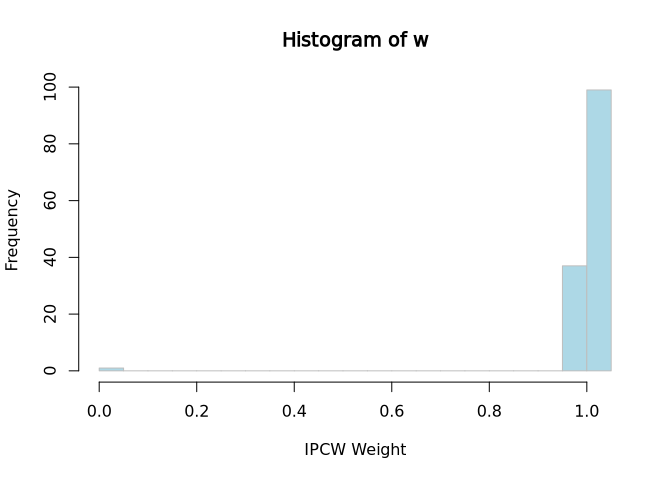

<!-- README.md is generated from README.Rmd. Please edit that file -->

# IPCWJK

<!-- badges: start -->

<!-- badges: end -->

    #> IPCW Jackknife Methods for Standard Errors in Survival Prediction

    #> Provides functions for fitting binary classification models with
    #>  inverse probability of censoring weights (IPCW) to estimate survival 
    #>  probabilities, and implements Jackknife resampling methods for unbiased 
    #>  prediction error estimation in survival analysis. The package supports model 
    #>  fitting, IPCW calculation, and Jackknife error estimation.

The documentation is available at
<https://github.com/IDEN-Project-UAS-Darmstadt/IPCWJK>

## Installation

You can install the development version of IPCWJK like so:

``` r
# With remotes
remotes::install_github("IDEN-Project-UAS-Darmstadt/IPCWJK")
# With pak (recommended for speed)
pak::pkg_install("IDEN-Project-UAS-Darmstadt/IPCWJK")
```

## Example

``` r
library(survival)
tau <- 80
df <- veteran[, c("time", "status", "trt")]
newdata <- data.frame(trt = c(1, 2))

# Calculation of IPCW weights at tau
library(IPCWJK)
w <- ipcw_weights(df, tau, time_var = "time", status_var = "status")
hist(w,
  breaks = 30,
  xlab = "IPCW Weight", col = "lightblue", border = "grey"
)
```



``` r
# Fit a log-logistic survival model
survreg_fit <- survreg(Surv(time, status) ~ trt,
  data = df,
  dist = "loglogistic"
)
# This provides you with an Wald CI on the logit scale:
pred_fun <- deltamethod_from_model(survreg_fit, tau = tau)
pred_fun(newdata)
#>   prediction     lower     upper         se
#> 1  0.4834551 0.3802014 0.5867088 0.05268045
#> 2  0.4130325 0.3106990 0.5153660 0.05221096

# Fit a logitIPCW model
library(mets)
logipcw_fit <- logitIPCW(Event(time, status) ~ trt, time = tau, data = df)
predfun_logit <- deltamethod_from_model(logipcw_fit, tau = tau)
pred_fun(newdata)
#>   prediction     lower     upper         se
#> 1  0.4834551 0.3802014 0.5867088 0.05268045
#> 2  0.4130325 0.3106990 0.5153660 0.05221096

# IPCW Logistic Regression
fit <- ipcw_logistic_regression(df,
  tau = tau, time_var = "time",
  status_var = "status"
)
predict(fit, newdata)
#>   prediction     lower     upper         se
#> 1  0.5602241 0.4397994 0.6739532 0.06084509
#> 2  0.4277286 0.3149444 0.5485602 0.06069209

# IPCW XGBoost Classifier
fit <- ipcw_xgboost(df, tau = tau, time_var = "time", status_var = "status")
predict(fit, newdata)
#>   prediction     lower     upper         se
#> 1  0.4919162 0.4324719 0.5515900 0.03053219
#> 2  0.4809798 0.3994607 0.5635243 0.04223412
```

# Development

Restore the development environment with:

``` r
renv::restore()
```

then use anything available in the `devtools` package to develop the
package.

``` r
library(devtools)
document() # to update documentation and roxygen functionality
load_all() # to load the package functions for development
build_readme() # to update the README
test() # to run tests
check() # to check the package
covr::package_coverage() # to check code coverage
styler::style_pkg() # to style the code
lint() # to check the code for linting issues
```
