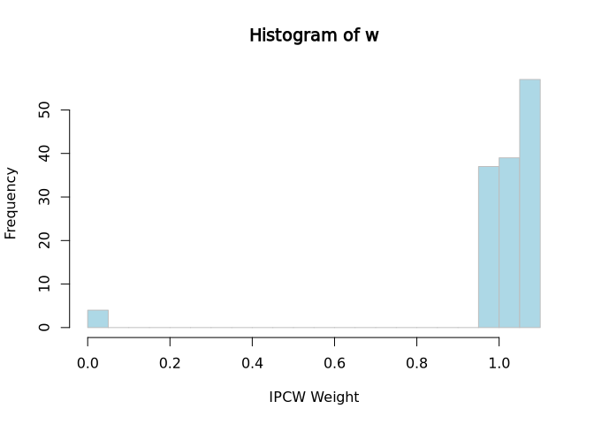

<!-- README.md is generated from README.Rmd. Please edit that file -->

# IPCWJK

<!-- badges: start -->

<!-- badges: end -->

IPCW Jackknife Methods for Standard Errors in Survival Prediction

Provides functions for fitting binary classification models with inverse
probability of censoring weights (IPCW) to estimate survival
probabilities, and implements jackknife resampling methods for unbiased
prediction error estimation.

The documentation is available at
<https://iden-project-uas-darmstadt.github.io/IPCWJK/>

## Installation

You can install the development version of IPCWJK like so:

``` r
# With remotes
remotes::install_github("IDEN-Project-UAS-Darmstadt/IPCWJK")
# With pak (recommended for speed)
pak::pkg_install("IDEN-Project-UAS-Darmstadt/IPCWJK")
```

Releases of the library can be found
[here](https://github.com/IDEN-Project-UAS-Darmstadt/IPCWJK/releases).

## Examples

IPCW weights can be calculated with the `ipcw_weights` function.

``` r
library(survival)
tau <- 100
df <- veteran[, c("time", "status", "karno", "age")]
newdata <- data.frame(karno = c(80, 70), age = c(40, 50))

# Calculation of IPCW weights at tau
library(IPCWJK)
w <- ipcw_weights(df, tau, time_var = "time", status_var = "status")
hist(w,
  breaks = 30,
  xlab = "IPCW Weight", col = "lightblue", border = "grey"
)
```



For `survreg` models with a log-logistic distribution and `logitIPCW` we
provide convenient access to Wald confidence intervals based on the
delta method on the logit scale.

``` r
# Fit a log-logistic survival model
survreg_fit <- survreg(Surv(time, status) ~ karno + age,
  data = df,
  dist = "loglogistic"
)
# This provides you with an Wald CI on the logit scale:
pred_fun <- deltamethod_from_model(survreg_fit, tau = tau)
pred_fun(newdata)
#>   prediction     lower     upper         se
#> 1  0.6087168 0.4506212 0.7668123 0.08066101
#> 2  0.4815100 0.3795966 0.5834235 0.05199666

# Fit a logitIPCW model
library(mets)
logipcw_fit <- logitIPCW(Event(time, status) ~ karno + age,
  time = tau,
  data = df
)
pred_fun <- deltamethod_from_model(logipcw_fit, tau = tau)
pred_fun(newdata)
#>   prediction     lower     upper         se
#> 1  0.7406860 0.5672413 0.9141306 0.08849216
#> 2  0.5808678 0.4513883 0.7103472 0.06606092
```

Models using IPCW are also available. For these, we provide the
jackknife-based estimation of the standard error and Wald confidence
intervals based on the delta method on the logit scale.

``` r
# IPCW Logistic Regression
fit <- ipcw_logistic_regression(df,
  tau = tau, time_var = "time",
  status_var = "status"
)
predict(fit, newdata)
#>   prediction     lower     upper         se
#> 1  0.7477355 0.5387945 0.8826380 0.08960564
#> 2  0.5819723 0.4455359 0.7069205 0.06821779

# IPCW XGBoost Classifier
fit <- ipcw_xgboost(df, tau = tau, time_var = "time", status_var = "status")
predict(fit, newdata)
#>   prediction     lower     upper         se
#> 1  0.7654250 0.5621175 0.8924056 0.08545969
#> 2  0.5937184 0.4579942 0.7164942 0.06741503
```

# Development

Restore the development environment with:

``` r
renv::restore()
```

Then use anything available in the `devtools` package to develop the
package.

``` r
library(devtools)
document() # to update documentation and roxygen functionality
load_all() # to load the package functions for development
build_readme() # to update the README
test() # to run tests
check() # to check the package
covr::package_coverage() # to check code coverage
styler::style_pkg() # to style the code
lint() # to check the code for linting issues
```
